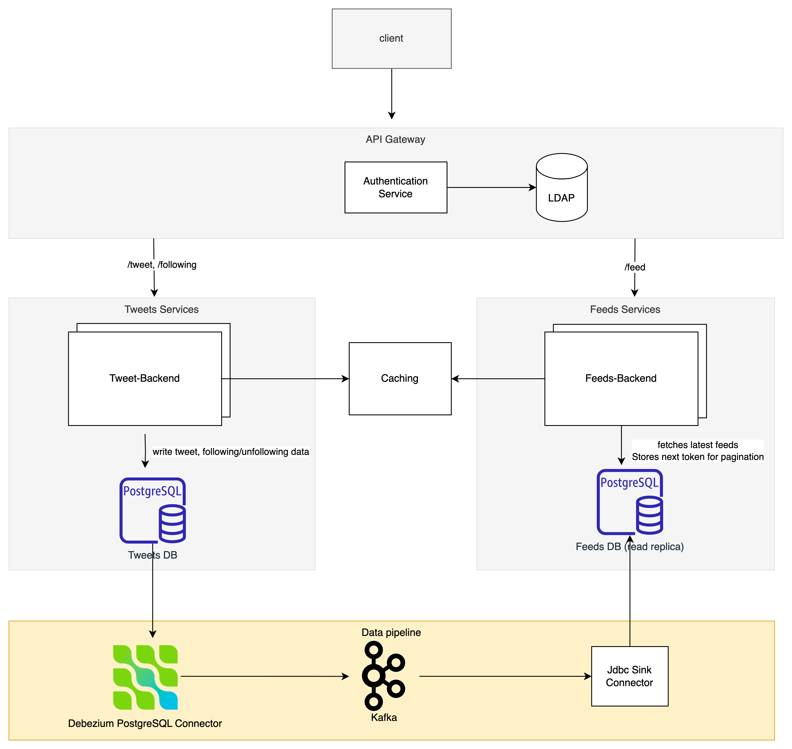
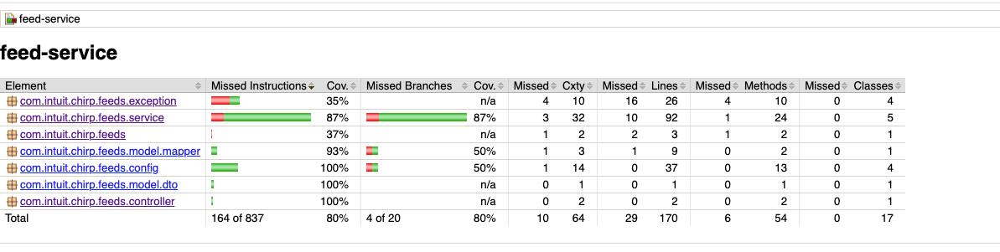
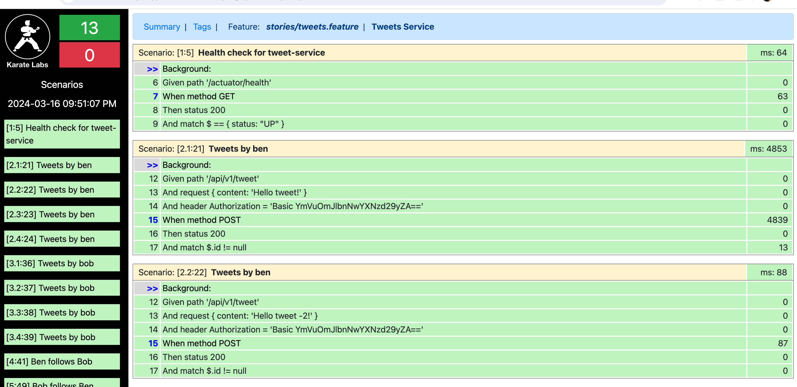
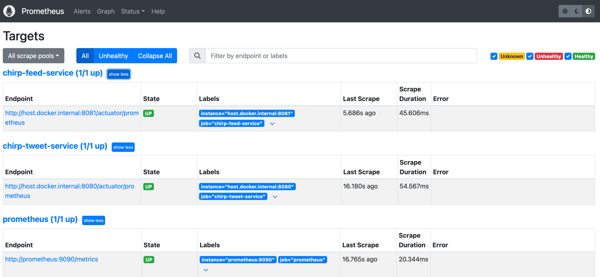

# Intuit Craft (Backend) - Intuit Chirp

## Design Inputs

### Business Case

As part of enhancing our internal services which are available to our employees, we would like to build a Twitter like
solution for our employees, where employees can tweet and have followers.

### Functional Requirements

1) We have 10K employees.
2) Employees can follow/unfollow their colleagues
3) Employees can post (or tweet) messages to their followers.
4) Use corporate LDAP for user Management.
5) On an average, every employee will send approximately 10 messages a day to their followers.
6) On the home page we need to show 100 most recent tweets. Optionally you can support pagination.
7) The Restful service /feed should list 100 recent tweets for the logged-in user.

### Non Functional Requirements

1) Availability
2) Observability
3) Monitoring
4) Containerization

## Architecture overview

### Capacity Estimations

In order to decide the backing services & high level design, we'll start with volume estimation for  10k daily active users with 10 messages per day and content limited to text:

 - Messages per day = 10,000 * 10 = 100,000 messages/day
 - Messages QPS = 100,000 / (24 hours * 3600 seconds) is approximately 1 message per second, peak would be 2 qps
 - Storage for tweet metadata: 10,000 * 10 tweets * 32 bytes = 3.2 MB per day
 - Storage for text content: 10,000 * 10 tweets * 240 bytes = 24 MB per day
 - 5-year storage for text content: (3.2 MB + 24 MB) * 365 days * 5 years = 40 GB (rounded)

### Architecture Decision Records (ADRs)

#### On-demand Feed Generation

* Typically, twitter like services tend to follow the fan-out approach for feed timeline generation so that the timeline for each user is already generated. 
* Based on the volume of query the application needs to serve, precalculating the feed using a fan out service could be an over-engineered approach for the given load characteristics. 
* Assuming a user has 1K following and each user has 100 tweets, the amount of data to be processed to generate the timeline is 100 K entries. Given the heap-based feed generation logic, this requires 100K * 16B (tweet id + timestamp are stored in heap) requires 1.5MB of data loaded in memory per request. Feed generation per request is hence the used approach.

#### Separating Write vs Read Traffic

- Given a twitter like service, which is more read-heavy, we'd have to scale the read services & DB independent of the write service. 
- It would help the architecture extensible in terms of scaling the services separately if needed and flexible in terms of how data is being stored or feed is generated.
- The application follows a CQRS pattern to writing tweets (command) and feed generation (read queries). 

### High Level Design

The application uses a microservices based approach to separate the domain. There are 2 microservice in the system.

1) Tweet-service
   - serves the endpoints /tweet, /following for CRUD operations.
   - Tweets and following information is persisted into the database.
2) Feed-service
   - serves the endpoint /feeds.
   - fetches the data from the read replica of Tweets-service database, stores the token for pagination of feeds.



## Design Details

### User feed Generation

- For every valid /feed request, the feeds service queries the ids of the users the logged-in user follows.
- The service then fetches the tweets of all the followings from the db, based on reverse chronological order of tweets.
- This data is used by TopKFeedsProcessor service that uses a max heap that uses the timestamp info
  to heapify the tweet data.
- The feeds are extracted from the heap according to the maximum feed size configured per application.
- The processor maintains a map of user id versus the last tweet timestamp processed for feed generation to enable
  pagination.
- The feed service uses a token based approach; UUID is generated against the last processed timestamp and the data is
  persisted.
- The application provides this UUID as part of the /feeds response.
- For a paginated feed, the application serves /feed with a valid UUID token. Feed service ensures that this token is
  invalidated once used to fetch the next page.

### LDAP Integration

- The application uses Spring Cloud gateway to define the paths and destination for different services
- The application uses UnboundID, an open source java based SDK for LDAP server integration with SpringBoot.
- The Spring security uses the ldap authentication based on the data fed into LDAP directory server for all the
  application APIs.
- The auth server generates a jwt based on the valid basic auth passed along the incoming request, which in turn would be used by tweet and feed service. 

### Data pipeline for Read Replicas

- The feeds service works on a read replica of the tweets db.
- The application uses Debezium for change data capture.
- The postgreSQL connector is configured as the source to fetch the data tweets db and is written to the configured
  kafka topics.
- The JDBC sink connectors are defined per table to write data into the feeds db.
- The application makes use of lenses which is a container environment for multiple source, sink connectors and kafka
  cluster to enable the data flow

## API Usage Examples

[Postman Collection for API reference](https://documenter.getpostman.com/view/28786439/2sA2xjyWWD)

## Testing

- The implementation is complete with unit tests for feed-service and tweet-service
- Karate tests are also written for end to end API testing that follows through for all scenarios implemented

## Code Coverage

- JaCoCo is used to determine the code coverage. The plugin is configured to generate the report per application build.
  

- Karate Test Coverage

  Karate tests are used to cover end to end scenario API testing for feed and tweet services  
  

## Monitoring

- The application has added dependency for capturing the metrics; implementation uses micrometer and prometheus.
- The service are configured as targets as part of the configuration.
  
- The application uses Grafana inorder to view the metrics in a configured dashboard environment.
- Custom metrics can also be added, one such example is a tweets-metrics added to keep track of a tweet counter.
  

## Implementation - Out Of Scope

- The API gateway integration is currently out of scope for this version of implementation
- LDAP Authentication is handled in each microservice. this can be moved to a generic auth-server

## Installation

- Run the docker compose to bring up the required container images - postgres db, lenses, prometheus, grafana,
  redis
  
  ```she
  <project> $ cd docker
  <project> $ docker compose up -d
  ```
  
- Do a mvn clean install and mvn spring-boot:run on api-gateway, auth-server, tweet-service and feed-service in the root directory to bring both the
  applications up
  
- The actuator endpoint /health is enabled on both the applications to check the status.

- Refer to section to API usage to access the API documentation for both service endpoints.

## References

- [UnboundID - Java based SDK for LDAP Integration](https://ldap.com/unboundid-ldap-sdk-for-java/)  
- [Debezium - open source platform providing resources for CDC](https://debezium.io/documentation/)  
- [Lenses - Containerized Apache Kafka ecosystem for development](https://lenses.io/blog/2021/04/change-data-capture-apache-kafka-break-up-monolith/)  
- [Liquibase - DB change management](https://docs.liquibase.com/home.html)
- [Prometheus documentation](https://prometheus.io/docs/introduction/overview/)  
- [Grafana dashboards](https://grafana.com/grafana/dashboards/11378-justai-system-monitor/)  
- [BDD testing using Karate](https://www.baeldung.com/karate-rest-api-testing)
- [Spring Cloud gateway](https://spring.io/projects/spring-cloud-gateway)  
- [Spring security - jwt integration](https://www.danvega.dev/blog/spring-security-jwt)
